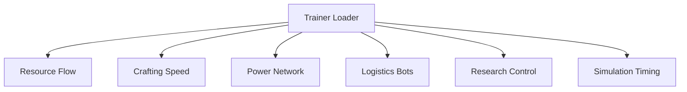

## Overview

Defined as a factory-state control layer, **Factorio Trainer** interfaces with the active simulation of Factorio to modify how production systems, logistics networks, and world rules behave in real time. The trainer operates on live counters and conditional checks rather than save editing, allowing temporary intervention in crafting flow, power logic, and entity behavior. Secondary associations include automation trainer, runtime resource editor, production control utility, and simulation override system.

---

## Resource Flow Override Module

* Direct adjustment of item and fluid quantities
* Infinite resource lock per entity or network
* Consumption bypass toggles

**In-game behavior:**
Alters resource deltas during production and transfer without modifying recipe definitions.

---

## Crafting and Recipe Acceleration

* Instant craft completion
* Global crafting speed multipliers
* Per-recipe time override

**Feature intent:**
Modifies crafting resolution timing to accelerate or normalize production output.

---

## Power Network Control Layer

* Unlimited power generation toggle
* Accumulator charge lock
* Consumption cap suppression

**In-game behavior:**
Overrides power availability checks while preserving network topology and connections.

---

## Logistic and Bot System Manipulation

* Construction bot instant build
* Logistic bot capacity scaling
* Network range extension

**Feature intent:**
Adjusts bot-related limits and task resolution to streamline construction and delivery.

---

## Research and Technology Handling

* Instant research completion
* Science pack requirement bypass
* Technology state lock

**In-game behavior:**
Forces technology progression flags without altering the research tree structure.

---

## Time and Simulation Speed Control

* Custom game speed multipliers
* Tick-rate stabilization
* Pause-state override

**Feature intent:**
Controls simulation tempo while maintaining deterministic entity updates.

---

## Pollution and Enemy Pressure Overrides

* Pollution generation disable
* Biter aggression scaling
* Evolution factor freeze

**In-game behavior:**
Modifies environmental pressure variables influencing enemy behavior and expansion.

---

## Trainer Interface and Session Scope

* Toggle-based control panels
* Hotkey-driven activation
* Safe unload with state restoration

**In-game behavior:**
Ensures all overrides remain session-scoped and revert cleanly on exit.

---

---

## FAQ

**Does the trainer change save files?**
No, all adjustments apply only to the active simulation session.

**Can infinite resources be limited to specific machines?**
Yes, resource locks can be applied per entity or network.

**Are research changes reversible?**
Technology states can be reset before unloading.

**Does speed control break automation logic?**
Tick-rate stabilization prevents desync in inserters and belts.

**Can pollution be restored to default behavior?**
Environmental variables revert when overrides are disabled.

**Is multiplayer supported?**
Functionality is intended for single-session simulation control.

---

## Feature Summary

* Runtime resource and fluid control
* Crafting and recipe time overrides
* Power network manipulation
* Logistic and construction bot scaling
* Research and technology state control
* Simulation speed and tick management
* Pollution and enemy behavior adjustment
* Session-scoped trainer interface with rollback

---
